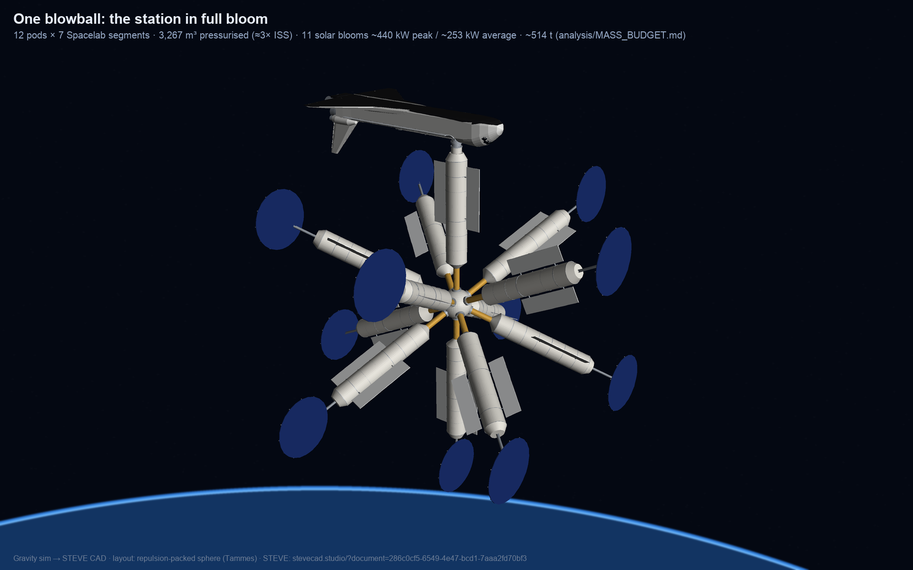

# steveVgravity: Blowball Station

A dandelion seed head as a space station. A 6 m hub carries pods of Spacelab-derived flight segments on pressurized
stalks. Each pod ends in a sun-tracking solar bloom, with radiator fins along it. A New Shuttle docks on the axial pod.

The station is designed in two tools that talk to each other:

- **Gravity** (simulation): packs the pod directions on a sphere by repulsion (the Thomson/Tammes problem), works
  out a balanced assembly order, and time-lapses the build.
- **STEVE** (CAD): rebuilds the identical station from the same knob values as parametric CAD, with a berthing
  animation of every segment.



## The idea in one paragraph

Each launch delivers one pod as 7 berthable flight segments, carried in the New Shuttle's stretched 26.3 m bay.
The station arm berths them one at a time, from the hub outward. Pods are added in opposite pairs, the way mint and
basil grow their leaves (the phyllotaxis inhibitor rule produces the same order), so the centre of mass returns to
the hub after every second launch. The default station has:

- 12 pods
- about 3,300 m³ pressurized (≈ 3× ISS)
- 11 blooms at about 440 kW peak, about 250 kW orbit-average
- 12 launches
- about 514 t ([mass budget](analysis/MASS_BUDGET.md))

These are order-of-magnitude estimates, not sized engineering. See [ROADMAP.md](ROADMAP.md).

## Repository

| Path | What |
|---|---|
| `gravity/blowball_station.js` | The Gravity sim. In Gravity: **New** → paste the file → Run. |
| `gravity/blowball_layout.py` | Python port of the sim's layout and assembly order (JS and Python agree to < 7 mm). |
| `steve/` | Source of the STEVE documents (station, orbiter, New Shuttle, flight segment, payload, Spacelab-7). Each folder's `steve.json` links the live document. |
| `renders/` | Stills and videos. Open `renders/index.html`. |
| `renders/tools/` | Render pipeline: headless sim recorder, a small mesh renderer, local tessellation of the STEVE geometry. |
| `analysis/` | Mass budget ([MASS_BUDGET.md](analysis/MASS_BUDGET.md): 514 t, 41 t per launch) and the pod structural check ([STRUCTURAL.md](analysis/STRUCTURAL.md): STEVE static + modal with hand checks; the root flare). |
| `ROADMAP.md` | Where the project stands and what comes next. |

## Reproduce the renders

```sh
cd renders/tools
python3 render_all.py all                     # stage stills, hero shots, berthing video (needs numpy, Pillow, ffmpeg)
node gravity_record.mjs /tmp/rec.bin 840 0.0667 && python3 gravity_video.py /tmp/rec.bin /tmp/frames ../gravity_timelapse.mp4
```

## Credits

- **[STEVE](https://stevecad.studio)** for the CAD modelling: parametric parts and designs, linked documents, joints
  and the keyframed berthing animation. The flight-segment mesh in `renders/tools/assets/` is STEVE's own export.
  The station and orbiter render meshes are tessellated locally from the same code and parameters as the STEVE
  documents, because STEVE can't export print meshes for an assembly this size.
- **Gravity** (holodeck1.ai) for the simulation runtime the sim is written for.
- Spacelab, the Space Shuttle orbiter, the ISS Common Berthing Mechanism and the NASA Docking System are NASA/ESA
  programmes. Dimensions are taken from public descriptions, simplified.
